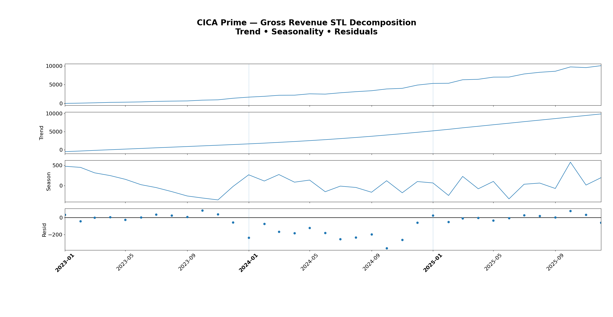
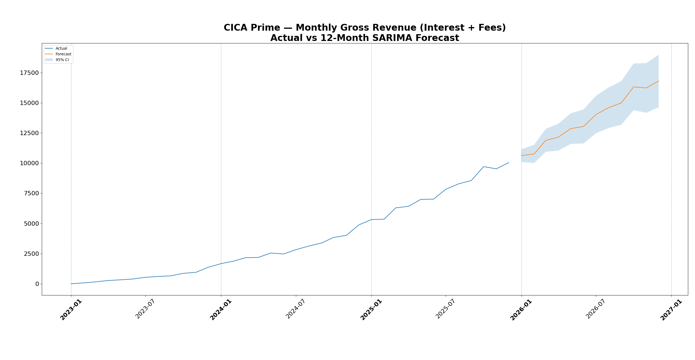

WIP ( Work in Progress ) Jan 31th 2026

# Consumer Credit “Cica PRIME” Risk & Portfolio Analytics  
**Risk Management • Portfolio Analytics • Forecasting • Stress Testing**

This project analyzes synthetic but realistic consumer installment lending data from CICA (Consumer Installment Credit Account) Prime, a simulated consumer credit product designed to resemble real-world installment lending / BNPL-style portfolios offered by fintechs and traditional banks. The product extends unsecured credit to consumers and generates revenue through interest and fees, while incurring credit losses through delinquency and default.

The dataset spans January 2023 to December 2025 and includes loan-level, customer-level, and payment-level data, along with contractual payment schedules, macroeconomic scenarios, and internal budget plans. The data captures the full credit lifecycle: customer acquisition, underwriting decisions, loan origination, repayment behavior, delinquency, default, recoveries, and portfolio-level financial outcomes.

The analysis focuses on risk-aware, finance-aligned analytics, modeling how portfolio growth, repayment behavior, and credit losses are expected to evolve over time under different conditions. The goal is to evaluate portfolio health, revenue sustainability, and downside risk using predictive modeling, time-series forecasting, and scenario-based stress testing, consistent with how consumer lending analytics teams operate in practice.

  

➤ **Project Goal / Purpose:**  

The goal of this project is to understand how CICA Prime’s consumer lending portfolio grows over time, how stable that growth is, and how exposed the business is to downside risk. The analysis uses forecasting, predictive modeling, and standard credit risk techniques commonly applied in consumer lending.

The project looks at how revenue, cash inflows, delinquency, and defaults are expected to change over time, and compares actual results to internal plans to evaluate how accurate and resilient the business’s financial planning is. At the borrower and loan level, the analysis estimates customer lifetime value, the likelihood that borrowers stop using the product, and the likelihood that loans default, with the goal of using past behavior to make informed predictions about future outcomes.

At the portfolio level, the project measures expected credit losses, evaluates how concentrated revenue and risk are across borrowers, and tests how the portfolio would perform under different economic conditions. The goal is to determine whether portfolio growth is supported by sustainable cash flows and manageable credit risk, or whether it relies on elevated risk, loose underwriting, or a small group of borrowers—especially when economic conditions worsen.

  

➤ **Skills Demonstrated:**  

Consumer lending analytics and KPI design, credit portfolio performance analysis, delinquency and default analysis (DPD, roll rates, vintage curves), cohort-based customer lifetime value (LTV) modeling, probability of default (PD) modeling, loss analysis using EAD and LGD concepts, revenue and cash-flow analysis, budget vs actual variance analysis, and macro-driven stress testing and scenario analysis

**(SQL • Python • Pandas • Time-Series Forecasting • Credit Risk Metrics • Executive-Ready Analysis)**

  

➤ **Core Business Questions:**

**1 — Forecasting & Financial Planning**

1. **Revenue performance & outlook**   How did monthly interest and fee revenue perform from 2023–2025, and what is the expected revenue trajectory over the next 12 months?
2. **Cash inflows vs contractual expectations**   How do actual monthly cash collections compare to scheduled payments from 2023–2025, and how reliable are collection gaps across these 36 months?
3. **Delinquency & default trends**   How have delinquency and default rates evolved, and what do these trends indicate about portfolio credit health?
4. **Budget vs actual performance**   How reliable is financial planning given deviations between budgeted and realized revenue, cash inflows, and losses?

**2 — Borrower Activation, Churn & Value**

1. **Customer activation timing**   How long does it take newly acquired customers to originate their first loan?
2. **Borrower inactivity & churn risk**   Which customers are most likely to stop borrowing after their initial loan?
3. **Customer lifetime value (LTV)**   Which customers are expected to generate the highest lifetime value after accounting for credit losses?
4. **Value concentration**   How concentrated is customer value, and how dependent is portfolio performance on top-value segments?

**3 — Credit Risk Modeling & Portfolio Loss Dynamics**

1. **Probability of default (PD)**   Which individual loans are most likely to default based on borrower, loan, and early behavior signals?
2. **Exposure at default (EAD)**   How much exposure remains outstanding at the time loans default?
3. **Loss given default (LGD)**   How severe are losses after recoveries, and how do they vary across segments?
4. **Vintage risk performance**   How do cumulative defaults and losses evolve by origination vintage?
5. **Credit policy & decision thresholds**   Where should approval, review, and rejection thresholds be set based on predicted default risk?
6. **Model monitoring & governance**   How stable and well-calibrated are credit risk models over time?

**4 — Portfolio Fragility & Stress Testing**

1. **Macro stress & portfolio survival**   Under adverse macroeconomic scenarios, can portfolio revenue absorb stressed credit losses without threatening business viability?

  

**➤ Executive Summary:**
WORK IN PROGRESS !!!
FOR LATER.

  

**➤ The Dataset**

The raw dataset spans January 2023 through December 2025, and all reporting and conclusions in this project are intentionally scoped to this full three-year period to evaluate portfolio growth, seasonality, underwriting changes, and macro-driven risk cycles, while supporting time-series forecasting, predictive modeling, portfolio risk analytics, and stress testing in a consistent analytical framework.

The analysis uses seven core tables representing a consumer installment lending product (“CICA Prime”):

**customers**
- One row per customer
- Contains signup_date, acquisition channel, risk_tier_at_signup, and demographic buckets (income_band, region, age_band)
- Used to define customer cohorts, segment performance, and build customer-level features for LTV / churn / PD modeling

**applications**
- One row per credit application
- Contains application date, approval/decline decision, approved amount, and a synthetic decision_score with reason codes for declines
- Used to analyze conversion funnels, approval rates, underwriting shifts over time, and credit policy tightening/loosening

**loans**
- One row per booked loan
- Contains origination details (principal, term_months, apr, origination fees), merchant category, and lifecycle outcomes (loan_status, default_date)
- Used as the central table for portfolio analytics, risk segmentation, PD/LGD/EAD construction, and cohort/vintage analysis

**payment_schedule**
- One row per contractual installment
- Contains due_date and the contractual split between due_principal and due_fee_interest, plus scheduled remaining balance
- Used to measure scheduled cash flows, delinquency timing, and to establish the “what should have happened” baseline for forecasting and variance analysis

**payments**
- One row per cash event
- Contains payment_date, payment_amount, split between paid_principal and paid_fee_interest, plus payment_type (scheduled, partial, refund, recovery)
- Used to measure actual cash collections, revenue realized through fees/interest, delinquency behavior, recoveries after default, and net loss outcomes

**macro_monthly**
- One row per month per scenario
- Contains monthly macro indexes (unemployment_index, rates_index, consumer_stress_index) for baseline, adverse, and severe scenarios
- Used for stress testing, scenario comparison, and macro-driven sensitivity analysis of delinquency/default behavior and portfolio losses

**budget_plan_monthly**
- One row per month per plan scenario
- Contains planned originations, cash inflow, revenue, and net losses under base vs stretch plans
- Used for budget vs actual variance modeling, planning accuracy evaluation, and “what management expected vs what happened” analysis

**dim_month**
- Calendar spine to help with time series modeling.
- This is an additional "tool" to help with the calculation. Not data in itself.

  

## The Main Report - Key Questions Answered

### 1 — Forecasting & Financial Planning

**1.1. Revenue Performance & Outlook**

How did total portfolio interest and fee revenue perform on a monthly basis from 2023 through 2025, and what is the expected monthly revenue performance over the next 12 months?

**Tables used**
- payments
- dim_month ( the calendar spine )

**SQL Method**
- Filter gross revenue (`paid_fee_interest`) for all `payment_type` labeled `scheduled` or `partial`.
- Aggregate monthly realized interest and fee revenue using `payment_date`, converted to a `year_month` configuration.
- Left join to a calendar spine to ensure zero-revenue months are included.

**Python Method**
- Load the monthly revenue output from SQL and index it by `year_month` as a monthly time series (`.asfreq("MS")`).
- Run STL decomposition (`period=12`) and plot the trend, seasonal, and residual components to diagnose revenue structure.
- Fit the historical monthly revenue series into a seasonal SARIMA model to capture short-term dynamics and yearly seasonality.
- Generate a 12-month forecast and extract the forecast table (`mean`, `mean_ci_lower`, `mean_ci_upper`).
- Plot actual vs forecast and shade the confidence interval to visually communicate expected trajectory and uncertainty.

**Charts**

  

  

**Key Insights**

- Monthly interest and fee revenue rises steadily from 2023 through 2025, with faster absolute growth in 2024–2025 than in 2023.
- The revenue trend is smooth and strongly upward, indicating structural growth rather than short-lived spikes.
- Revenue shows stable annual seasonality, with recurring intra-year patterns that are materially smaller than the underlying growth trend.
- Residual variation is centered around zero with no persistent structure, suggesting most revenue movement is explained by trend and seasonality.
- The 12-month SARIMA forecast projects continued month-over-month revenue growth beyond 2025.
- Forecast uncertainty increases gradually over the horizon, but the lower confidence bound remains well above earlier historical revenue levels.

