# WIP ( Work in Progress ) Feb 18th 2026

# Consumer Lending “Cica PRIME” Credit Risk and Portfolio Analytics  
**Risk Management • Portfolio Analytics • Forecasting • Stress Testing**

This project analyzes synthetic but realistic consumer installment lending data from CICA (Consumer Installment Credit Account) Prime, a simulated consumer credit product designed to resemble real-world installment lending / BNPL-style portfolios offered by fintechs and traditional banks. The product extends unsecured credit to consumers and generates revenue through interest and fees, while incurring credit losses through delinquency and default.

The dataset spans January 2023 to December 2025 and includes loan-level, customer-level, and payment-level data, along with contractual payment schedules, macroeconomic scenarios, and internal budget plans. The data captures the full credit lifecycle: customer acquisition, underwriting decisions, loan origination, repayment behavior, delinquency, default, recoveries, and portfolio-level financial outcomes.

The analysis focuses on risk-aware, finance-aligned analytics, modeling how portfolio growth, repayment behavior, and credit losses are expected to evolve over time under different conditions. The goal is to evaluate portfolio health, revenue sustainability, and downside risk using predictive modeling, time-series forecasting, and scenario-based stress testing, consistent with how consumer lending analytics teams operate in practice.

  

➤ **Project Goal / Purpose:**  

The goal of this project is to understand how CICA Prime’s consumer lending portfolio grows over time, how stable that growth is, and how exposed the business is to downside risk. The analysis uses forecasting, predictive modeling, and standard credit risk techniques commonly applied in consumer lending.

The project looks at how revenue, cash inflows, delinquency, and defaults are expected to change over time, and compares actual results to internal plans to evaluate how accurate and resilient the business’s financial planning is. At the borrower and loan level, the analysis estimates customer lifetime value, the likelihood that borrowers stop using the product, and the likelihood that loans default, with the goal of using past behavior to make informed predictions about future outcomes.

At the portfolio level, the project measures expected credit losses, evaluates how concentrated revenue and risk are across borrowers, and tests how the portfolio would perform under different economic conditions. The goal is to determine whether portfolio growth is supported by sustainable cash flows and manageable credit risk, or whether it relies on elevated risk, loose underwriting, or a small group of borrowers—especially when economic conditions worsen.

  

➤ **Skills Demonstrated:**  

Consumer lending analytics and KPI design, credit portfolio performance analysis, delinquency and default analysis (DPD, roll rates, vintage curves), cohort-based customer lifetime value (LTV) modeling, probability of default (PD) modeling, loss analysis using EAD and LGD concepts, revenue and cash-flow analysis, budget vs actual variance analysis, and macro-driven stress testing and scenario analysis

**(SQL • Python • Pandas • Time-Series Forecasting • Credit Risk Metrics • Executive-Ready Analysis)**

  

➤ **Core Business Questions:**

**1 — Forecasting & Financial Planning**

1. **Revenue performance & outlook**   How did monthly interest and fee revenue perform from 2023–2025, and what is the expected revenue trajectory over the next 12 months?
2. **Cash inflows vs contractual expectations**   How do actual monthly cash collections compare to scheduled cash collections from 2023–2025, and what is the resulting monthly collection gap? How large is the monthly collection gap relative to scheduled cash, and how stable is this gap over time?
3. **Budget vs actual performance**   How reliable is financial planning given deviations between budgeted and realized revenue, cash inflows, and losses?
4. **Delinquency & default trends**   Did borrowers begin falling behind on payments before credit losses increased sharply?

**2 — Borrower Activation, Churn & Value**

1. **Customer activation timing**   How long does it take newly acquired customers to originate their first loan?
2. **Borrower inactivity & churn risk**   Which customers are most likely to stop borrowing after their initial loan?
3. **Customer lifetime value (LTV)**   Which customers are expected to generate the highest lifetime value after accounting for credit losses?
4. **Value concentration**   How concentrated is customer value, and how dependent is portfolio performance on top-value segments?

**3 — Credit Risk Modeling & Portfolio Loss Dynamics**

1. **Probability of default (PD)**   Which individual loans are most likely to default based on borrower, loan, and early behavior signals?
2. **Exposure at default (EAD)**   How much exposure remains outstanding at the time loans default?
3. **Loss given default (LGD)**   How severe are losses after recoveries, and how do they vary across segments?
4. **Vintage risk performance**   How do cumulative defaults and losses evolve by origination vintage?
5. **Credit policy & decision thresholds**   Where should approval, review, and rejection thresholds be set based on predicted default risk?
6. **Model monitoring & governance**   How stable and well-calibrated are credit risk models over time?

**4 — Portfolio Fragility & Stress Testing**

1. **Macro stress & portfolio survival**   Under adverse macroeconomic scenarios, can portfolio revenue absorb stressed credit losses without threatening business viability?

  

**➤ Executive Summary:**
WORK IN PROGRESS !!!
FOR LATER.

  

**➤ The Dataset**

The raw dataset spans January 2023 through December 2025, and all reporting and conclusions in this project are intentionally scoped to this full three-year period to evaluate portfolio growth, seasonality, underwriting changes, and macro-driven risk cycles, while supporting time-series forecasting, predictive modeling, portfolio risk analytics, and stress testing in a consistent analytical framework.

The analysis uses seven core tables representing a consumer installment lending product (“CICA Prime”):

**customers**
- One row per customer
- Contains signup_date, acquisition channel, risk_tier_at_signup, and demographic buckets (income_band, region, age_band)
- Used to define customer cohorts, segment performance, and build customer-level features for LTV / churn / PD modeling

**applications**
- One row per credit application
- Contains application date, approval/decline decision, approved amount, and a synthetic decision_score with reason codes for declines
- Used to analyze conversion funnels, approval rates, underwriting shifts over time, and credit policy tightening/loosening

**loans**
- One row per booked loan
- Contains origination details (principal, term_months, apr, origination fees), merchant category, and lifecycle outcomes (loan_status, default_date)
- Used as the central table for portfolio analytics, risk segmentation, PD/LGD/EAD construction, and cohort/vintage analysis

**payment_schedule**
- One row per contractual installment
- Contains due_date and the contractual split between due_principal and due_fee_interest, plus scheduled remaining balance
- Used to measure scheduled cash flows, delinquency timing, and to establish the “what should have happened” baseline for forecasting and variance analysis

**payments**
- One row per cash event
- Contains payment_date, payment_amount, split between paid_principal and paid_fee_interest, plus payment_type (scheduled, partial, refund, recovery)
- Used to measure actual cash collections, revenue realized through fees/interest, delinquency behavior, recoveries after default, and net loss outcomes

**macro_monthly**
- One row per month per scenario
- Contains monthly macro indexes (unemployment_index, rates_index, consumer_stress_index) for baseline, adverse, and severe scenarios
- Used for stress testing, scenario comparison, and macro-driven sensitivity analysis of delinquency/default behavior and portfolio losses

**budget_plan_monthly**
- One row per month per plan scenario
- Contains planned originations, cash inflow, revenue, and net losses under base vs stretch plans
- Used for budget vs actual variance modeling, planning accuracy evaluation, and “what management expected vs what happened” analysis

**dim_month**
- Calendar spine to help with time series modeling.
- This is an additional "tool" to help with the calculation. Not data in itself.

  

## The Main Report - Key Questions Answered

### 1 — Forecasting & Financial Planning

 

**1.1. Revenue Performance & Outlook**

How did total portfolio interest and fee revenue perform on a monthly basis from 2023 through 2025, and what is the expected monthly revenue performance over the next 12 months?

**Tables used**
- payments
- dim_month ( the calendar spine )

**SQL Method**
- Filter gross revenue ( **paid_fee_interest** ) for all **payment_type** labeled **scheduled** or **partial**.
- Aggregate monthly realized interest and fee revenue using **payment_date**, converted to a **year_month** configuration.
- Left join to a calendar spine to ensure zero-revenue months are included.
- SQL Output : a simple table with two columns, **year_month** and **gross_revenue**.

**Python Method**
- Load the monthly revenue output from SQL and index it by `year_month` as a monthly time series (`.asfreq("MS")`).
- Run STL decomposition (`period=12`) and plot the trend, seasonal, and residual components to diagnose revenue structure.
- Fit the historical monthly revenue series into a seasonal SARIMA model to capture short-term dynamics and yearly seasonality.
- Generate a 12-month forecast and extract the forecast table (`mean`, `mean_ci_lower`, `mean_ci_upper`).
- Plot actual vs forecast and shade the confidence interval to visually communicate expected trajectory and uncertainty.

 

**Charts**

  

  

**Key Insights**

- Revenue rose consistently from 2023 through 2025 as the loan portfolio expanded and more borrowers generated interest and fee income. 
- Early-stage growth was rapid due to the small starting base, while later growth reflects a more mature and scaled lending operation.
- The upward movement is mainly driven by portfolio expansion rather than strong seasonal effects.
- Month-to-month revenue fluctuations remain moderate relative to the overall growth trend, indicating stable performance.
- The 12-month forecast points to continued growth if current portfolio dynamics persist.

All revenue figures reflect cash actually collected from borrowers, ensuring alignment with real liquidity rather than accounting estimates.

  

**1.2. Cash Inflows vs Contractual Expectations**

How do actual cash collections compare to scheduled payments on a monthly basis from 2023 through 2025?
How stable / reliable are monthly collection gaps across this period?

**Tables used**
- **payment_schedule** , contractual principal and interest due
- **payments** , actual cash collected
- **dim_month** ( the calendar spine )

**SQL Method**
- Aggregate monthly scheduled cash flows from **payment_schedule**.
- Aggregate monthly actual cash flows from payments.
- Align both series on the same monthly calendar spine.
- Compute monthly cash collection gaps -> gap amount = actual − scheduled
- SQL output: one clean monthly table with columns(**year_month**, **scheduled_cash**, **actual_cash**, **cash_flow_gap**)

**Python Method**
- Load the monthly table that shows how much cash was expected and how much cash was actually collected for each month.
- For each month, calculate the cash gap percentage by dividing the difference between actual and expected cash by the expected cash.
- Summarize the results by reporting the average gap percentage, how much the gap percentage varies from month to month, and how often monthly cash collection is below expectations.
- Plot the monthly cash gap percentage over time and label each month with its exact value so the chart is easy to read.

 

**Charts**

  

 

**Key Insights**
- Actual cash collected falls short of scheduled cash in the large majority of months (32 out of 35), indicating a consistent collection gap.
- On average, monthly collections are about 4–5% below contractual expectations.
- Over-collection occurs rarely and only by small margins, suggesting upside surprises are limited.
- The largest shortfall occurred early in the portfolio lifecycle, with performance stabilizing in later periods.
- Month-to-month variation in the gap is moderate, showing the shortfall pattern is persistent rather than random.

  

**1.3. Budget vs Actual Performance**

Did actual revenue earned, cash collected, and credit losses differ from what management planned?

 

**Tables used**
- budget_plan_monthly — planned revenue ($), cash inflow ($), net credit loss ($) by month + scenario
- payments — actual cash received and realized interest+fees
- loans — default event timing (only for labeling / cohorting if needed)
- calendar spine

 

**SQL Method :**  
This work produces three tables.

**Actual Revenue:**
- **Identify realized revenue cashflows:** Use the payments table and keep only rows where **payment_type** IN ('scheduled','**partial******') so revenue reflects interest/fees actually collected.
- **Aggregate to monthly revenue:** Group by **payment_date** month and sum **paid_fee_interest** to produce **actual_revenue** by year_month.
- **Preserve missing months:** Left join the monthly revenue series to **dim_month** on **month_start** so every month appears even when revenue is zero, and fill missing months with 0.
- **Output the revenue table:** Return **year_month** and **actual_revenue** ordered by **year_month**. 

**Actual Cash:**
- **Identify all cash collected:** Use the payments table and include all payment rows so this metric captures total cash inflow, not just revenue.
- **Aggregate to monthly cash:** Group by **payment_date** month and sum **payment_amount** to produce **actual_cash** by year_month.
- **Preserve missing months:** Left join the monthly cash series to **dim_month** on month_start so every month appears even when cash is zero, and fill missing months with 0.
- **Output the cash table:** Return **year_month** and **actual_cash** ordered by **year_month**.

**Actual Net Credit Loss:**
- **Identify default events:** Filter loans to only defaulted loans where **default_date** IS NOT NULL so losses are tied to actual defaults.
- **Measure unpaid principal at default:** Left join defaulted loans to payments on loan_id and keep only payments with **payment_date** <= **default_date**, then sum paid_principal for **payment_type** IN ('**scheduled**','**partial**') to compute **principal_paid_pre_default**.
- **Aggregate monthly principal loss:** For each defaulted loan compute principal - **principal_paid_pre_default** and sum by the month of default_date to produce **actual_loss_unpaid_principal** by year_month.
- **Preserve missing months for loss:** Left join monthly principal loss to **dim_month** so every month appears, and fill missing months with 0.
- **Measure monthly recoveries:** From payments, filter to **payment_type** = **'recovery'** and sum **payment_amount** by month to produce **actual_loss_recovered_principal**.
- **Compute monthly net loss:** For each month compute **actual_loss** = **actual_loss_unpaid_principal** - **actual_loss_recovered_principal**, using 0 for missing recoveries, and output **year_month** and **actual_loss** ordered by month.

 

**Python Method :**

**Budget vs Actual Revenue:**
- Load monthly actual revenue and monthly budget plan data, and convert the month fields into real dates so the timeline is consistent.
- Align both datasets to a monthly calendar index so every month exists in order, then fill missing actual revenue months with 0 so “no activity” is treated as 0.
- Build two budget revenue series (Base and Stretch) by filtering the budget data by scenario and aggregating planned revenue per month, then join them side-by-side.
- Join actual revenue to the two budget revenue series by month so each month has Actual, Budget(Base), and Budget(Stretch).
- Compute variance in dollars (Actual − Budget) and variance percent ((Actual − Budget) ÷ Budget) for both Base and Stretch, treating 0-budget months as undefined percent variance.
- Plot a two-panel chart: top panel shows Actual vs Base vs Stretch in dollars; bottom panel shows monthly variance percent vs Base and Stretch with a zero line.

**Budget vs Actual Cash:**
- Load monthly actual cash and monthly budget plan data, and convert the month fields into real dates so the timeline is consistent.
- Align both datasets to a monthly calendar index so every month exists in order, then fill missing actual cash months with 0 so “no activity” is treated as 0.
- Build two budget cash series (Base and Stretch) by filtering the budget data by scenario and aggregating planned cash inflow per month, then join them side-by-side.
- Join actual cash to the two budget cash series by month so each month has Actual, Budget(Base), and Budget(Stretch).
- Compute variance in dollars (Actual − Budget) and variance percent ((Actual − Budget) ÷ Budget) for both Base and Stretch, treating 0-budget months as undefined percent variance.
- Plot a two-panel chart: top panel shows Actual vs Base vs Stretch in dollars; bottom panel shows monthly variance percent vs Base and Stretch with a zero line.

**Budget vs Actual Net Credit Loss:**
- Load monthly actual net credit loss and monthly budget plan data, and convert the month fields into real dates so the timeline is consistent.
- Align both datasets to a monthly calendar index so every month exists in order, then fill missing actual loss months with 0 so “no loss recorded” is treated as 0.
- Build two budget loss series (Base and Stretch) by filtering the budget data by scenario and aggregating planned net losses per month, then join them side-by-side.
- Join actual loss to the two budget loss series by month so each month has Actual, Budget(Base), and Budget(Stretch).
- Compute variance in dollars (Actual − Budget) and variance percent ((Actual − Budget) ÷ Budget) for both Base and Stretch, treating 0-budget months as undefined percent variance; interpret positive variance as “losses worse than plan.”
- Plot a two-panel chart: top panel shows Actual vs Base vs Stretch in dollars; bottom panel shows monthly variance percent vs Base and Stretch with a zero line.

 

**Charts**

  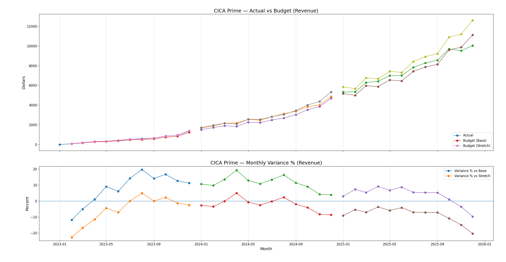

**Key Insights**
- Revenue grew steadily from 2023 through 2025, reflecting consistent portfolio expansion.
- During 2023 and most of 2024, actual revenue remained above the base plan, indicating stronger monetization than management initially forecasted.
- Performance periodically approached the stretch target in 2024, showing that growth was temporarily aligned with aggressive expectations.
- In 2025, revenue continued rising in absolute dollars but began underperforming both base and stretch plans, signaling a slowdown relative to budgeted growth.
- The variance trend shows a shift from outperformance in early years to underperformance later, suggesting planning assumptions became more aggressive than realized revenue growth.

 

  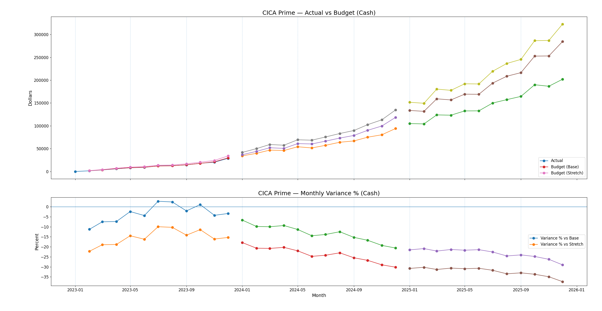

**Key Insights**
- Cash collections increased each year, reflecting portfolio expansion and higher repayment volumes.
- Actual cash fell below the base plan in nearly every month after early 2023, indicating consistent underperformance versus management expectations.
- The shortfall versus stretch targets was larger and persistent, showing that the aggressive growth scenario was not achieved.
- The variance trend shows the deviation becoming more negative over time, meaning the difference between expected and realized cash did not correct as the portfolio matured.
- By late 2025, the cash gap reached its widest levels, signaling structural pressure on liquidity relative to plan.

 

  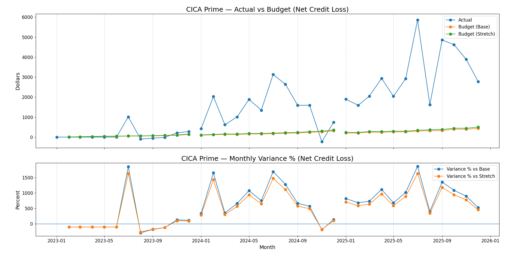

 

**Key Insights**
- Actual credit losses were much higher than planned in most months after early 2024.
- Losses increased sharply and stayed high through 2025, far above what the budget expected.
- Instead of rising slowly and smoothly, losses jumped in spikes, meaning defaults happened in waves.
- The difference between planned and actual losses became very large, especially during peak months.
- Compared to revenue and cash, credit losses were the biggest source of budget problems.

  

**1.4. Delinquency & Default Trends**  
Did borrowers begin falling behind on payments before credit losses increased sharply?

 

**Tables used**
- payment_schedule
- payments
- loans
- dim_month

 

**SQL Method**

To create the required table, the process is complex. Therefore, the SQL logic was separated into four sequential scripts. Each script must be executed in order. This approach mimics how real banks structure data pipelines. Breaking the logic into smaller steps reduces cognitive load, makes debugging easier, and allows each stage to be verified independently.

**01_4a — Scheduled Payment Plan**
- Build a month-end calendar from **dim_month** so each reporting month has a consistent **month_end** date.
- Join **payment_schedule** to the calendar using **due_date** <= **month_end** so each installment is counted once it becomes due.
- Aggregate to one row per **loan_id** + **month_end** and sum **due_total** to compute **due_at_month_end**.
- Output the cumulative contractual amount that should have been paid by each month-end.

**01_4b — Collected Payments**
- Build a month-end calendar from **dim_month**.
- Clean payments at the daily level: Keep **scheduled** and **partial** as positive and then convert **refund** to negative.
- Join cleaned payments to month-end using **payment_date** <= **month_end** so payments accumulate through time.
- Aggregate to one row per **loan_id** + **month_end** and sum as **paid_at_month_end**.
- Output the cumulative cash actually paid by each month-end.

**01_4c — Delinquency at Month-End**
- Join **scheduled** vs **paid** tables at **loan_id** + **month_end**.
- Compute **unpaid_at_month_end** as **due_at_month_end** − **paid_at_month_end**, floored at zero.
- For loans with unpaid balance, join back to payment_schedule to identify all due installments on or before month_end.
- For each loan-month, compute **oldest_unpaid_due_date** using MIN(due_date).
- Calculate dpd_days as the difference between **month_end** and **oldest_unpaid_due_date**.
- Assign **dpd_bucket** based on **dpd_days** (Current, 1–29, 30–59, 60–89, 90+).
- Output one clean loan-level delinquency snapshot per month-end.

**01_4d — Portfolio Delinquency Trend**
- Aggregate **01_4c_delinquency_at_month_end** by year_month:
  - Count total active loans.
  - Count loans in each DPD bucket.
- Compute **dpd_30_plus_rate** as (30–59 + 60–89 + 90+) divided by total active loans.
- Separately aggregate loans to count defaulted_loans by default month.
- Join delinquency metrics to monthly defaults.
- Output one monthly portfolio table showing delinquency trend and default trend side-by-side.

 

**Python Method**

- **Load the monthly trend dataset:** Read 01_4d_portfolio_delinquency_trend.csv, parse year_month as a date, sort by time, and set year_month as the time index so each row represents one month.
- **Standardize column names for stability:** Normalize column names (trim spaces, lowercase, replace spaces with underscores) so later steps do not break due to formatting differences.
- **Normalize the 30+ delinquency metric:** Identify the DPD 30+ rate column and convert it into a consistent percentage series so it is comparable month to month.
- **Smooth the signals for trend reading:** Compute a 3-month rolling average for DPD 30+ rate and for monthly defaulted loans to reduce noise and make the direction of change easier to see.
- **Convert bucket counts into portfolio mix shares:** If delinquency bucket count columns exist (Current, 1–29, 30–59, 60–89, 90+), divide each bucket by active_loans to create bucket share percentages for portfolio mix tracking.
- **Test whether delinquency leads defaults:** Run a lead/lag correlation check across multiple month lags to measure whether increases in DPD 30+ tend to show up before increases in defaults, and estimate the typical lead time in months.

 

**Charts**

  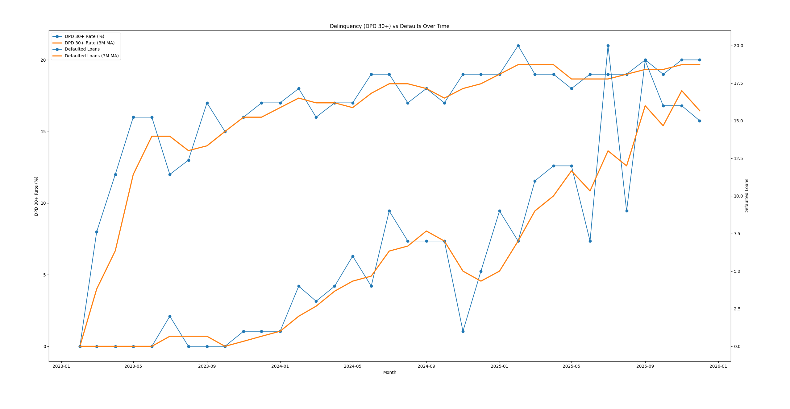

**Key Insights**
- DPD 30+ starts rising early and keeps trending upward.
- Defaults stay low at first, then increase later.
- Defaults move more sharply month-to-month; DPD rises more steadily.
- The rise in delinquency happens before the sustained rise in defaults.

 

  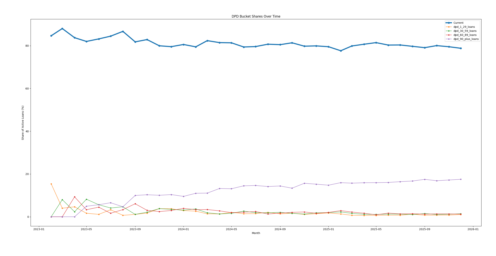

**Key Insights**
- The share of Current loans gradually declines over time.
- The 90+ delinquency bucket steadily increases.
- Early delinquency (1–29) rises before severe delinquency builds.
- Loans appear to migrate from Current → early delinquency → severe delinquency over time.

  

### 2 — Borrower Activation, Churn & Value

 

**2.1. Customer Activation Timing**

How long does it take customers to activate into credit usage by originating their first loan?

**Tables used**
- customers — signup date and segmentation attributes
- loans — first loan origination date
- dim_month ( the calendar spine )

**SQL Method**
- **Identify first credit usage**: Join loans to customers and, for each customer, find the earliest loan origination date that occurs on or after the signup date. This ensures activation reflects the first valid use of credit.
- **Measure activation delay**: Calculate activation time as the number of days between customer signup and first loan origination.
- **Summarize by cohort**: Group customers by signup month and compute the average and median activation days for each cohort to compare how quickly different signup cohorts activate into borrowing.
- SQL output : a table with these columns : year_month, n_customers, avg_activation_days, median_activation_days

**Python Method**
- Compute and visualize activation-time metrics by signup month, applying a cutoff defined as last month in the data minus 18 months so that only fully observable cohorts are included in trend analysis.
  
 

**Charts**

  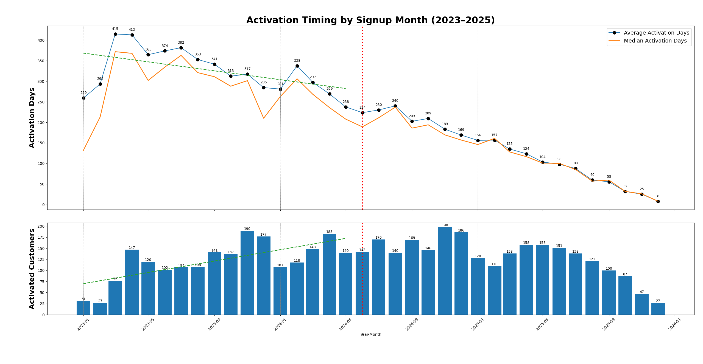

**Key Insights**
- Early cohorts (2023–early 2024) show activation taking roughly 6–12 months, meaning customers typically borrowed long after signup.
- Recent cohorts (late 2024–2025) appear to activate much faster, but these numbers are incomplete because many customers have not yet had 6 months to convert.
- The sharp drop in activation days in the second half of the chart is partly driven by data maturity, not purely by operational improvement.
- Only the fully matured portion of the chart (older cohorts) should be used to judge true activation speed trends.
- Based on matured data only, activation improved gradually over time, but there is no clear evidence yet that activation dropped to under one month for stable cohorts.
- Recent cohorts require more time before drawing strong conclusions about structural changes in customer behavior.

 
 

**2.2. Borrower Inactivity & Churn Risk**

Which customers are likely to stop borrowing or become inactive after their initial loan?

**Tables used**
- customers — customer attributes
- loans — loan timing and frequency

**SQL Method**
- The initial loan is defined as the earliest loan origination for each customer, ordered by origination date and loan ID.
- **Order loans and set end date**: Assign a fixed portfolio end date (2025-12-31) and number each customer’s loans by origination date (and **loan_id** for ties) so we can consistently identify “first” and “second” loans.
- **Isolate the first loan**: Keep only **loan_number** = 1 per customer to define the **first_loan_id** and **first_loan_date**, which anchors the customer’s borrowing start.
- **Isolate the second loan**: Keep only **loan_number** = 2 per customer to capture the earliest “return borrowing” event (**second_loan_id**, **second_loan_date**) if it exists.
- **Create the 180-day return window**: Join first and second loans and compute **daydate_180** = **first_loan_date** + 180 days to define the return window boundary.
- **Apply an observability cutoff** (include_flag): Mark customers as included only if **daydate_180** is on or before 2025-12-31, so every included customer has a fully observable 180-day return window.
- **Calculate inactivity score** :
	- For customers who are not included the score is set to NULL
	- For included customers who has no second loan, assign score = 1
	- For included customers who has second loan which is within 180 days after the first loan, calculate score = days between loans ÷ 180
	- For included customers who has second loan which is outside 180 days after the first loan, assign score = 1
- **Output the modeling table** : Return one row per customer containing first/second loan timing, the 180-day window boundary, the include_flag, and the final inactive_score target for downstream Python work.

**Python Method**
- **Load the modeling table**: Read the SQL output (one row per borrowing customer) and keep only rows where inactive_score is not null so the target is fully observable.
- **Validate the target**: Convert inactive_score to numeric and keep only valid values so summaries and plots do not break or misread the target.
- **Measure portfolio-level full inactivity**: Compute the share of observable customers with inactive_score = 1.00 to quantify customers who did not return within 180 days.
- **Summarize return timing distribution**: Describe and plot the distribution of inactive_score to separate the “fully inactive” mass at 1.00 from the return-timing spread among customers who came back within 180 days.
- **Create outcome buckets for communication**: Bucket customers into Low/Medium/High groups using fixed thresholds on inactive_score so results are easy to explain and compare across segments.

 

**Charts**

  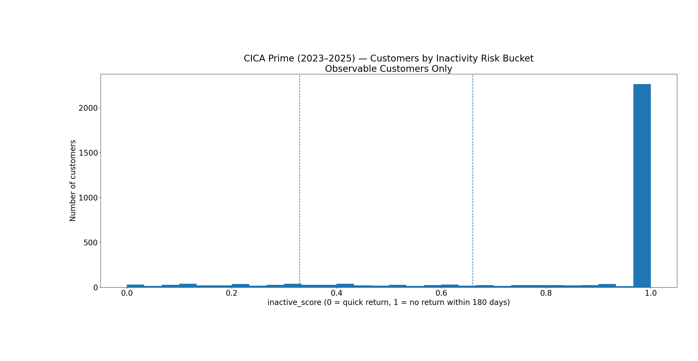

  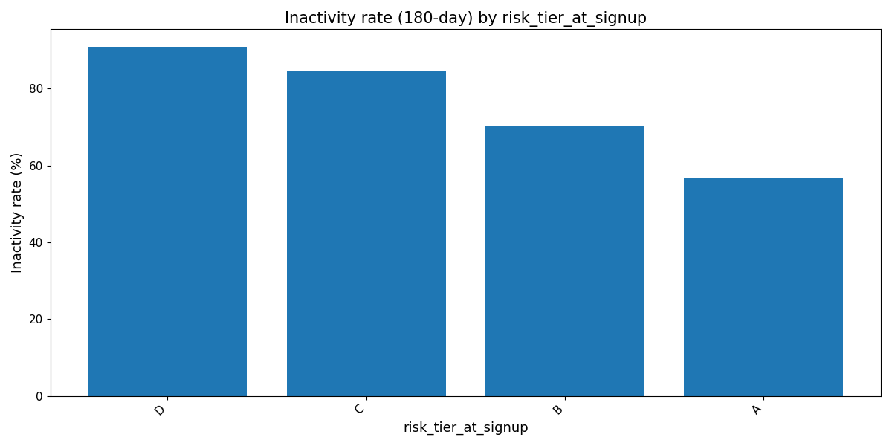

  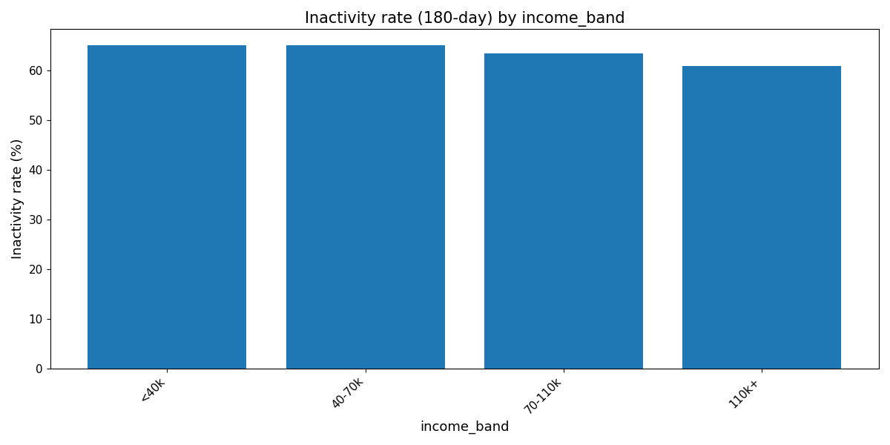

  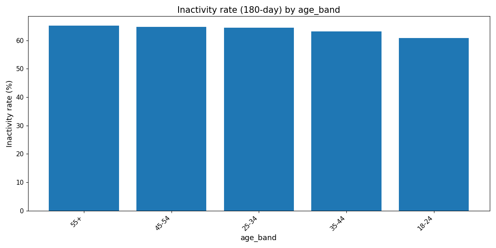

 

  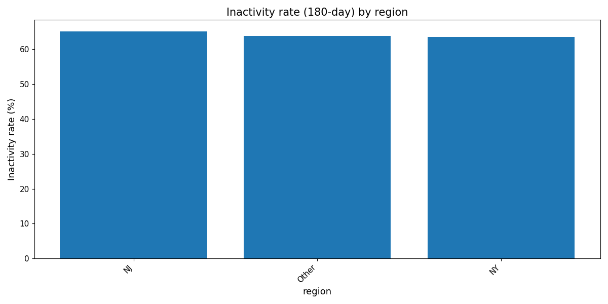

**Key Insights**
- Roughly 60–65% of customers do not return for a second loan within 180 days, meaning first-loan churn is common.
- Risk tier at signup is the strongest driver of inactivity, with a wide gap between Tier A and Tier D—lower tiers are far more likely to stop borrowing.
- Income level shows only small differences in inactivity, so earning more does not strongly predict repeat borrowing.
- Age groups behave similarly, with no major separation in churn risk across age bands.
- Region has minimal impact, as inactivity rates are nearly the same across locations.
- Acquisition channel differences are modest, and no channel changes churn risk as meaningfully as risk tier does.

  

**2.3. Customer lifetime value (LTV)**

Which customer(s) are expected to generate the highest lifetime value after accounting for credit losses?

**Tables used**
- customers
- loans
- payments

**SQL Method**
Two tables are created for the purpose of this business question, to simplify the steps.

**02_3a_customer_LTV_180d**
This is done first, to process and prepare necessary data and generate base table for LTV calculations.

- **Extract the loan population:** Pull one row per loan with core contract fields (**customer_id**, **loan_id**, **origination_date**, **principal**, **default_date**) to define the exposure base.
- **Filter valid payment events:** Keep only cash-collection payment types (**scheduled**, **partial**) so LTV reflects real collected cash.
- **Combine loans with payments:** Left join loans to payments so every loan remains in the dataset, including those with no payments.
- **Apply a 180-day observation window:** Create a cutoff date equal to origination date plus 180 days and retain only payments occurring within this window, while keeping loans with no payments.
- **Flag defaults within the window:** Mark loans as defaulted only if **default_date** exists and falls within the 180-day period.
- **Compute cumulative cash and principal per loan:** For each loan, calculate running totals of collected cash and principal repaid within the 180-day window, and assign a row number to identify the final event snapshot.
- **Select one 180-day snapshot per loan:** Keep only the final row per loan so each loan is represented once at the end of the 180-day period.
- **Calculate unpaid principal and credit loss:** Compute outstanding principal at 180 days and recognize it as loss only if the loan defaulted within the window.
- **Aggregate to the customer level:** Sum 180-day payments and losses across all loans per customer and compute net LTV as payments minus losses, then rank customers by net value.

**02_3b_customer_LTV_180d_summary**
This query summarizes the LTV data into a set of statistics that are easier to read and compare.

- **Split customers into 5 equal-sized LTV groups:** Sort customers by net_ltv_180d from highest to lowest and assign each customer to a bucket (1–5) using NTILE(5), where each bucket represents about 20% of customers.
- **Summarize value and loss by bucket:** For each bucket, compute customer count plus key statistics for payments, losses, and net LTV, including averages, minimum/maximum net LTV, and total sums, rounding outputs to 2 decimals for clean reporting.
- **Return bucket results in order:** Output the bucket-level summary table ordered from bucket 1 to bucket 5 for easy comparison across tiers.
  
**Python Method**
- **Load customer-level LTV data:** Read **02_3a_customer_LTV_180d**.csv into a dataframe so each row represents one customer’s 180-day performance.
- **Compute total collected cash:** Sum the total_payment_180d column to measure how much cash the portfolio collected within 180 days.
- **Compute total credit losses:** Sum the total_loss_180d column to measure how much principal was lost due to defaults within 180 days.
- **Identify the most profitable customer:** Sort customers by net_ltv_180d in descending order and select the first row to find the highest net value contributor.
- **Generate a concise report:** Print the portfolio-level totals and the top customer’s metrics in a clean, readable format for documentation and review.

 

  

  There is no data visualization chart necessary to answer the business question.

  

**2.4. Value Concentration**
How concentrated is customer value, and how dependent is portfolio performance on top-value segments?

**Tables used**
02_3a_customer_LTV_180d.csv, generated for business question 2.3.

- **Rank customers from highest value to lowest value:** Sort customers by **net_ltv_180d** in descending order, assign each a rank, divide the rank by total customers and multiply by 100 to produce the cumulative percentage of customers, which becomes the X-axis of the Pareto curve.
- **Build a running total of value:** Starting from the highest-value customer, add **net_ltv_180d** row by row down the ranked list to create a cumulative total showing how portfolio value builds across customers.
- **Convert cumulative value into percentage of total portfolio value:** Divide the cumulative total by total portfolio **net_ltv_180d** and multiply by 100 to calculate the cumulative percentage of value, which becomes the Y-axis of the Pareto curve.
- **Output the value concentration table:** Return customer-level **net_ltv_180d**, cumulative % of customers (**pareto_x**), and cumulative % of portfolio value (**pareto_y**), ordered from highest to lowest **net_ltv_180d**.

**Python Method**
- Python is not used to process the data further. It is only used to directly visualize the chart.

 

  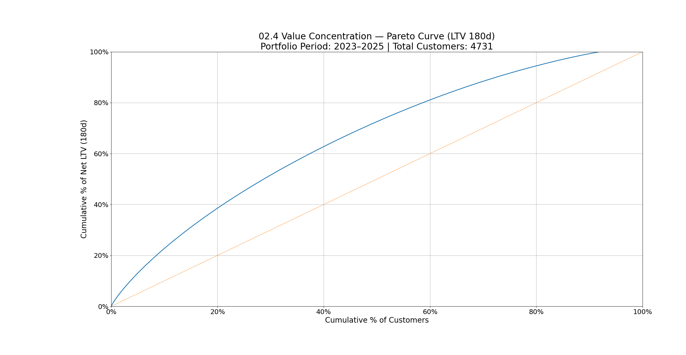

**Key Insights**
**Value is moderately concentrated:** about 60% of customers generate ~80% of total LTV, so the portfolio is not dependent on a tiny elite group. The portfolio is diversified and not fragile.

 
 

### 3 — Credit Risk Modeling & Portfolio Loss Dynamics

 

**3.1. Probability of default (PD)**  
Which individual loans are most likely to default based on borrower, loan, and early behavior signals?

The rules and definition :

**1) Time Horizon (12 months)**
- PD is measured over 12 months starting from each loan’s origination date.
- A loan is eligible only if the dataset contains the full 12-month window.
- With data ending on 2025-12-31, only loans originated on or before 2024-12-31 are included.
- Loans originated after 2024-12-31 are excluded because their 12-month outcome cannot be fully observed.

**2) Default Event (Primary Rule: 90+ Days Past Due)**
- A loan is considered “defaulted” if it reaches 90 or more Days Past Due (DPD) at any time within its 12-month observation window.
- DPD is defined at the scheduled-installment level:
  - An installment has a due date from the contractual payment schedule.
  - If the full due amount is not covered by payments applied to that installment, the installment is considered unpaid.
  - DPD counts calendar days since the due date.
  - If an installment is later fully covered, DPD stops on the date it becomes fully covered.
  - If an installment is never fully covered, DPD is measured up to the end of the 12-month window.

**3) Single Default Trigger (No Double Counting)**
- The loan default date is the first date the loan crosses 90+ DPD.
- Once defaulted, the loan stays defaulted for PD counting purposes.
- Each loan can default at most once.

**4) Measurement Unit (Loan-Level)**
- Default is measured at the loan level (not at the payment row level and not at the customer level).
- Each eligible loan contributes:
  - 1 = defaulted within 12 months
  - 0 = not defaulted within 12 months
- A customer with multiple loans can contribute multiple loan observations.

**5) PD Calculation**
- For any segment (example: risk tier at signup, origination month):
  PD = (number of eligible loans that default within 12 months) / (total eligible loans)

**Data Quality Notes (Rule-Based Handling)**
- Loans without required schedule data to compute DPD are excluded from the eligible set (data-quality exception).
- Early payoff does not count as default unless the loan already crossed 90+ DPD before payoff.

 

**Tables used :**
- loans
- customers

 

**SQL Methods :**
- **Add origination month label:** Create **origination_month** by truncating **origination_date** to the first day of its month so all loans from the same month group together.
- **Attach customer risk tier:** Join the loans to the customers table using **customer_id** so each loan carries **risk_tier_at_signup** for risk segmentation.
- **Flag 12-month observability:** Create **is_pd_eligible** by marking loans as 1 only when the loan’s **origination_date** is on or before DATE '2024-12-31', meaning a full 12 months can be observed in the dataset.
- **Flag default within 12 months:** Create **is_default_12m** by marking 1 when **default_date** exists and occurs on or before origination_date + INTERVAL '12 months', otherwise 0.
- **Final Output:** One row per loan with: **loan_id** , **customer_id** , **origination_date** , **origination_month** , **default_date** , **risk_tier_at_signup** , **is_pd_eligible** , **is_default_12m**

 

**Python Methods :**
- **Keep only “eligible” loans:** Only include loans marked is_pd_eligible = 1, because those loans had enough time to see whether they default within 12 months.
- **Overall 12M PD:** Count how many eligible loans defaulted within 12 months, then divide by how many eligible loans exist.
- **PD by risk tier:** Do the same PD calculation separately for each **risk_tier_at_signup** to see if higher-risk tiers actually default more.
- **PD by origination month (vintage):** Do the same PD calculation separately for each origination_month to see if newer cohorts are getting riskier or safer over time.

 

  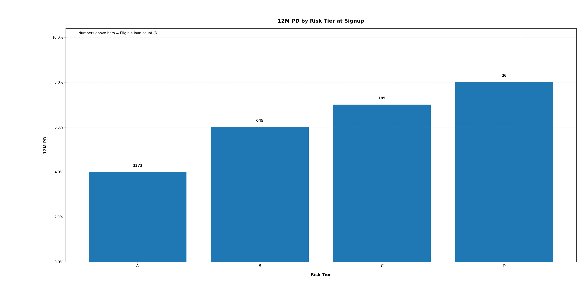

**Key Insights**
- Higher risk tiers default more often, which means the risk ranking is working properly.
- Most loans are in Tier A, so its 4% default rate is statistically reliable.
- Default rates increase steadily from A to D with no unexpected reversals.
- Tier D has only 26 loans, so its 8% default rate can change easily with just one additional default.
- Overall, the model is separating safer borrowers from riskier borrowers as intended.

 

  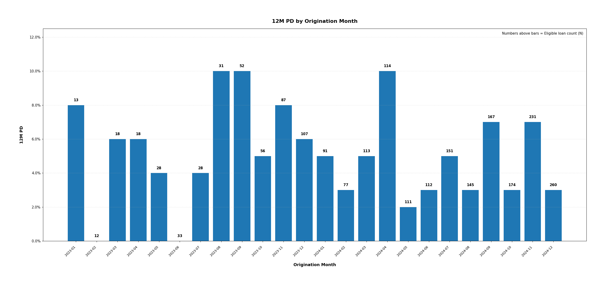

**Key Insights**
- Default rates fluctuate across months, showing that credit performance changes by cohort.
- Early 2023 months have very low loan counts, so their high or low PD values are not statistically reliable.
- Mid-2023 shows a temporary PD spike around 10%, but the loan volumes there are modest.
- Most 2024 months stay between 3% and 6%, indicating more stable portfolio performance.
- There is no consistent upward pattern across vintages, suggesting underwriting quality has not steadily worsened.

 
 

**3.2. Exposure at default (EAD)**  
How much exposure remains outstanding at the time loans default?

The rules and definition :

1) Exposure Definition (Principal-Only Rule)
<!-- -->
  - EAD is defined as the remaining principal balance at the moment the loan defaults.
  - Only principal exposure is considered.
  - Interest, fees, penalties, and any other non-principal components are excluded from the calculation.
  
2) Default Reference Point (Timing Rule)
<!-- -->
  - EAD is measured on the recorded default_date for each loan.
  - The default_date represents the first date the loan is classified as defaulted under the project’s default definition.
  - Only loans with a non-null default_date are included in EAD measurement.

3) Principal Paid Before Default
<!-- -->
  - Principal Repaid Before Default is the total sum of paid_principal amounts where payment_date is on or before default_date.
  - Payments occurring after default_date are ignored.
  - If no principal payments were made before default, the value is treated as zero.

4) EAD Calculation (Loan-Level)
<!-- -->
  - EAD is calculated at the loan level (not at the customer level and not at the payment row level).
  - For each defaulted loan:
  - EAD = Original Principal − Principal Repaid Before Default
  - If the calculation produces a negative value due to data irregularities, EAD is floored at zero.
  - Each defaulted loan contributes one EAD observation.

5) Measurement Scope (Defaulted Loans Only)
<!-- -->
  - Only loans that default are included in EAD measurement.
  - Non-defaulted loans are excluded because there is no default event to measure exposure against.
  - A customer with multiple defaulted loans contributes multiple EAD observations.
  - Data Scope Notes (Explicit Exclusions)

The following elements are not included in EAD:
- Accrued interest
- Unpaid interest
- Late fees
- Penalty charges
- Service or administrative fees
- Collection costs
- Legal expenses
- Revolving credit exposure adjustments (e.g., undrawn commitment factors) are not applicable in this installment-loan portfolio.

